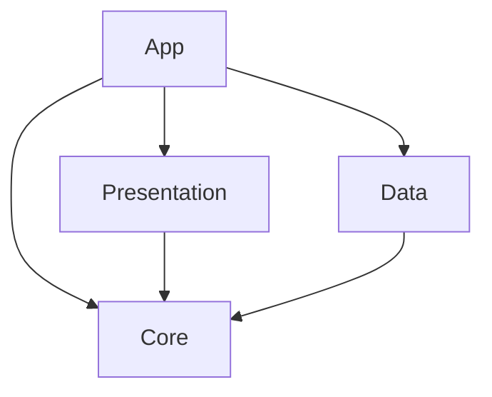

# squarebuzz

A nonogram (Picross) game for 6–12 year olds, built with .NET MAUI for **iPhone, iPad, Android
phone and tablet, and Windows**.

Fill squares from the numeric clues on each row and column and a hidden picture appears. Every
puzzle is solvable by pure logic — never by guessing — and the game checks that claim for every
puzzle it ships or generates.

## Repository layout

```
src/Squarebuzz.Core          Pure domain: rules, clue maths, constraint solver, puzzle generation,
                             the levels catalogue. No MAUI, no platform APIs.
src/Squarebuzz.Data          SQLite persistence behind the repository interfaces Core declares.
src/Squarebuzz.Presentation  ViewModels. Plain net10.0 + CommunityToolkit.Mvvm; MAUI-free.
src/Squarebuzz.App           The MAUI head: pages, board rendering, theming, platform partials.
tests/…                      xunit: Core, Data and Presentation. All run on any OS, no device.
tools/                       File-based scripts: puzzle validation, string checks, sound synthesis.
design/                      The original Claude Design prototype — the visual source of truth.
```

Project references point in these directions:



App is the composition root: `MauiProgram` wires the repository implementations in Data to the
interfaces declared in Core. Presentation uses those interfaces and has no dependency on Data.
Core has no project or package dependencies.

## Build, run, test

Requires the exact .NET SDK version in [global.json](global.json) with the `maui-windows`,
`android`, `ios` and `maccatalyst` workloads,
and Visual Studio 2026 for the `.slnx` solution. iOS and Mac Catalyst need a paired Mac with Xcode
to deploy; the managed code compiles on Windows.

Local builds and every CI job use that SDK version, with automatic SDK roll-forward disabled.
Install it side by side with other SDKs if necessary. Update `global.json` when adopting an SDK
update (including security patches), then run the tests, content validators and platform builds
before merging. This pins the compiler and bundled analyzers; MAUI workloads and Xcode are still
selected separately and are not pinned by this file.

```bash
dotnet build squarebuzz.slnx                                   # everything
dotnet test tests/Squarebuzz.Core.Tests                        # or Data.Tests / Presentation.Tests

dotnet build src/Squarebuzz.App -f net10.0-android -t:Run      # Android, emulator running
dotnet build src/Squarebuzz.App -f net10.0-windows10.0.19041.0 -t:Run

# One platform only, without the other workloads installed (what CI does):
dotnet build src/Squarebuzz.App -c Release -p:SquarebuzzTargetFramework=net10.0-android

dotnet run tools/validate-puzzles.cs      # every authored puzzle solves by logic alone
dotnet run tools/check-strings.cs         # every translation matches the neutral culture
dotnet run tools/generate-sounds.cs       # regenerates Resources/Raw/*.wav
cd design && npm start                    # the prototype, at http://127.0.0.1:5173
```

Use `-t:Run` for Android rather than `adb install` — Debug builds use Fast Deployment, and a
hand-installed APK crashes on launch with *No assemblies found*. On Windows, `REGDB_E_CLASSNOTREG`
means the 2.x Windows App Runtime is missing; Visual Studio installs it on first deployment.

## How the game is put together

**Saves store marks and a seed, never the picture.** A generated puzzle is rebuilt from its seed on
resume, so a save is only meaningful while the generator still turns that seed into the same
picture. Every save records `GeneratorVersion.Current`; **bump it whenever a change alters what any
seed produces** — a different radius, one extra random draw, anything. Saves from another version
are purged once at startup, before any screen can count them. Authored puzzles are looked up by id
and are unaffected.

**The generator proves its own output.** `BlobPuzzleGenerator` scatters mirrored blobs to a target
density; `UniqueSolutionGenerator` wraps it and rejects any candidate the line solver cannot finish
without guessing. Only the wrapped form is registered. `BlobPuzzleGeneratorTests` pins the picture
*quality* statistically over 200 seeds per size — density, mirror-axis artefacts, clue noise —
because a generator can satisfy every structural rule and still draw poor pictures.

**Play** is a 600-level campaign: 5×5 for levels 1–40, then 10×10, 15×15 and 20×20 bands, with
generator difficulty ramping 1→5 inside each. The seventy authored pictures are woven in as
evenly spaced milestone levels, locked packs included — meeting a picture at its level is how its
pack is earned. `LevelCatalog` is a pure function of the level number and the shipped content; the
only stored campaign state is `highest_level` on the progress row.

**Quick game** is the free-choice screen. The 25×25 grid is offered only where `IDeviceScreen`
reports room for it (≥760 units or a tablet/desktop idiom), shown locked rather than hidden on
phones. A remembered size or pack that is no longer available falls back rather than being played.

**The daily** is generated from the date (`DailyPuzzle.SeedFor`), forced past the authored
pictures so it never repeats one, and the same for every player. **Timed trials** are the game's
only way to lose: three rungs, played Sharp on a fresh generated grid, never saved — a race you can
resume tomorrow is not a race. The clock measures real elapsed time via `IClock.Monotonic`, not
timer ticks.

**Trophies** are nine named constants in `TrophyEvaluator`; their thresholds are a proposal.

## Settings and accessibility

Every switch in Options writes through immediately and takes effect at once. **Adding a setting is
four steps and the compiler checks none of them:** add it to `GameSettings`, read *and* write it
in `SqliteSettingsRepository`, add a `partial void On<Name>Changed` hook in `OptionsViewModel` so
it persists, then make something consume it. Settings have reached the database and back without
step four before.

The OS **Reduce Motion** setting, the **screen reader** state and the board's **drag ownership**
against scrolling hosts each have a platform partial under `Platforms/Android`, `Platforms/Apple`
(shared by iOS and Mac Catalyst) and `Platforms/Windows`. Any head without one falls back to the
safe default; none of the shipped heads does.

When a screen reader is running, the board — a `GraphicsView`, invisible to the accessibility
tree — gets one focusable button per square, each announcing its position, contents and both
clues. Descriptions are composed in the ViewModels so they localise and track state. Gallery cards
say nothing about an unfound picture beyond its size.

Sounds under `Resources/Raw` are synthesised by `tools/generate-sounds.cs` and are placeholders for
a sound designer. There is deliberately no mistake sound. Voice narration uses the platform TTS
engine and refuses to speak in a language the device has no voice for.

## Localisation

Thirty-nine languages, one `AppStrings.<code>.resx` each. `tools/check-strings.cs` enforces
identical key sets and placeholders across all of them; CI runs it. A missing key falls back to
the key itself rather than crashing, so a slip is ugly and obvious. Headings use the display face
only where it covers the script — see `AppLanguages.All`.

## Continuous integration

`.github/workflows/ci.yml` runs five jobs on push and pull request:

| Job | Runner | Covers |
|---|---|---|
| `domain` | ubuntu + windows | Builds and tests Core, Data and Presentation. No MAUI workload. |
| `content` | ubuntu | `check-strings.cs` and `validate-puzzles.cs`. |
| `android` | windows | Builds and uploads the APK. |
| `ios` | macos | Builds the simulator target — the only iOS compile check for a Windows dev machine. |
| `app-warnings` | windows | Rebuilds the MAUI head with `-warnaserror`, which the project relaxes locally. |

CI builds a clean checkout; a local build is incremental and will not re-run analysers on
up-to-date outputs, nor notice a file that was never committed. To reproduce CI faithfully build
from `git archive HEAD`, not from the working directory. The `ios` job picks its Xcode by trying
each installed version newest-first until one resolves the macOS SDK; the reasoning is in the
workflow file.

## Conventions

- MVVM via `CommunityToolkit.Mvvm` source generators. ViewModels are disposed when their page is
  popped (`PageLifecycle`); every one unsubscribes from the language-changed event there.
- Central Package Management: versions live only in `Directory.Packages.props`.
- Warnings are errors in Core, Data and Presentation. The MAUI head relaxes this for generated
  code; the `app-warnings` job restores it.
- Colours come only from the theme dictionaries in `Resources/Themes` via `DynamicResource`.
  Fonts are named by alias (`Display`, `Body`, `BodyBold`), never by file, and nothing uses
  `FontAttributes="Bold"` — see `Resources/Fonts/README.md`.
- Two MAUI quirks worth knowing: `FlowDirection` on a layout only reorders children *before* first
  measure (bind `Grid.Column` per child instead when order changes at runtime), and a `Label` in a
  `DataTemplate` can clip its last line without complaint — check multi-line strings on a device.
- Comments explain *why*. Most non-obvious decisions are documented next to the code they govern.

## Licence

Code is under the **BSD 3-Clause License** — see [LICENSE](LICENSE).

The bundled fonts, Fredoka and Quicksand, are under the **SIL Open Font License 1.1**; their
licence texts ship beside them in `Resources/Fonts/` and must stay there. The sound effects are
generated by `tools/generate-sounds.cs` and carry the code licence.
